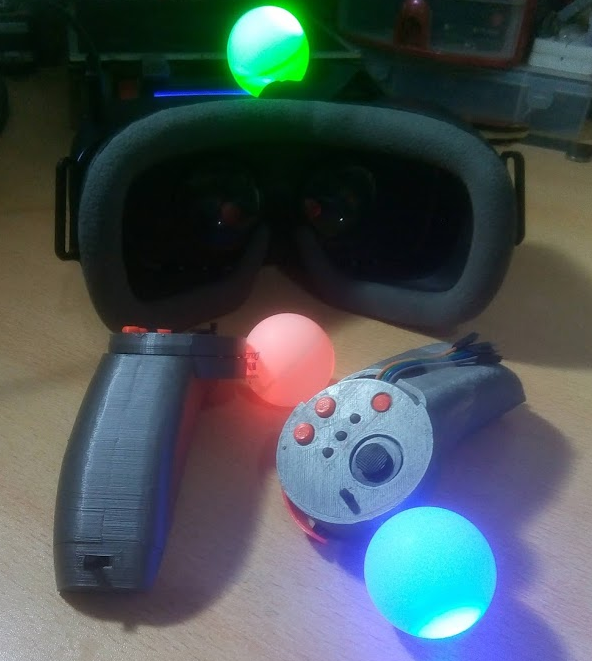

# HadesVR       
HadesVR is a SteamVR compatible VR setup made for tinkerers. 

The setup includes DIY controllers that are capable of emulating HTC vive wands or most aspects of the Valve Index Knuckles controllers (including finger tracking!). It also includes tracking electronics for a Headset, including an integrated wireless receiver to receive the controllers' data.

There's also custom controller hardware like 3d printable shells (still a bit of a WIP) with their respective custom PCBs to build your own Knuckles controllers.

The SteamVR driver used to be based off of [TrueOpenVR](https://github.com/TrueOpenVR) but it's modified so heavily I'm making it it's own thing.
This driver also uses [PSMoveService](https://github.com/psmoveservice/PSMoveService) (for now at least) for the positional tracking of HMD and controllers, using ping pong balls and different colours of LED's.

For more information on *everything*, check out the [docs](docs/DocsIndex.md)!

# How does it work and what can it do?

The headset connects to the PC and receives rotation and button data from both controllers through RF, while the tracking is done outside-in (base stations) using Playstation Move Cameras and [PSMoveService](https://github.com/psmoveservice/PSMoveService).

You can use the setup in: 
* Headset and controllers mode: The headset receives data from the controlers and mixed with the PSMoveService position tracking you get full 6dof tracking.
* Headset only mode: where you only have your HadesVR headset and the 6dof tracking (or 3dof if you don't use PSMoveService)
* Controller only mode: where if you already have a headset, you can use only the controllers part of the setup (you'll need to build an [RF receiver](docs/RFReceiver.md) to replace the HadesVR headset's built in one).

## What it can and cannot do:
* This driver partly supports Phone VR (RiftCat, etc): you'll get 6dof tracking for your controllers but only 3dof for your headset, meaning you'll have to stand still.
* This driver can emulate Wand and Index controllers.
* You can *sort of* play Beat Saber with this setup, as yaw drift is still an issue, the more you wack your controllers around the more they drift.
* This setup cannot do Inside out tracking.
* This driver cannot do Full body tracking ~~**yet**~~.

# Custom hardware
Thinking of building your own set of controllers? check out the [guide](docs/DocsIndex.md#controllers), for more info on the custom pcbs and 3d printable parts!

Or maybe you want to design your own, check out the [pinouts](docs/ControllerPinouts.md) for building the controllers with regular Arduino boards!

# Demos

6dof tracking and individual finger tracking demo:

Me being awful at beatsaber demo:

# To-do list:

### Github TODO:
- Write a basic guide and troubleshooting
- Write the joystick calibration sketches

### Project TODO:
- figure out a way to fix controller drift (dual blobs maybe?)
- full body tracking maybe?
- hardware design for the wand controllers (and maybe fbt trackers too?)
- Fix the 3d printable tabs
- Figure out a better way to mount the tp4056 that doesnt involve hot glue
- Implement hand bone finger tracking for games that use it (soon™)
- **Upgrade Serial to HID**