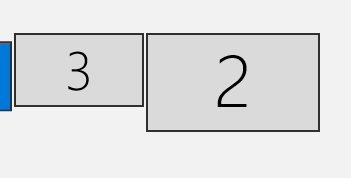

# Driver

# Driver Installation
Driver installation is quite simple, the steps are as follows:
* Download the latest release of the driver from the [Releases Page](https://github.com/HadesVR/HadesVR/releases)
* Unzip the driver into your Steam\steamapps\common\SteamVR\drivers folder.
* Configure the driver

Assuming you have already followed the steps in the [Tracking](Tracking.md) doc, you should have PSMoveService already installed in your PC.

If you don't plan on making a 6dof headset (for Sim racing, etc), you can skip the PSMoveService related steps.

# Driver Configuration

Driver configuration is pretty self explanatory, the driver configuration file is stored in hadesvr\resources\settings\default.vrsettings. To change the settings just open the file with the text editor of your liking.

If you're planning to use different drivers at the same time (HadesVR controllers with TOVR HMD for example), you'll also need to enable the `activateMultipleDrivers` setting in the Steam\config\steamvr.vrsettings file. 

The driver is currently divided into two sections:

### Under "Display" you'll find:
|Parameter|Type    |Description|
| ------  | ------ |------     |
| Stereo  | bool | Enables or disables Stereo display mode, keep enabled unless you're a cyclops.     |
| IsDisplayOnDesktop  | bool | This makes it so a warning telling you your display isn't in fullscreen mode pops up when your window focus isn't on the VR viewport.     |
| IsDisplayReal  | bool | ------     |
| DistanceBetweenEyes  | float | Same as IPD, the distance between your eyes in meters.     |
| IPD  | float | IPD setting, in meters.     |
| FOV  | float | FOV setting, in degrees.    |
| windowWidth  | int | Resolution Width of your VR screen     |
| windowHeight  | int | Resolution Height of your VR screen     |
| renderWidth  | int | The width (per eye) of the desired render resolution.     |
| renderHeight  | int |The height of the desired render resolution.     |
| displayFrequency  | float | Here goes the refresh rate of your display.     |
| windowX  | int | Here goes the Width resolution of your main screen.     |
| windowY  | int | Don't touch this one.     |
| ScreenOffsetX  | int | Viewport X offset.     |
| ScreenOffsetY  | int | Viewport Y offset.     |
| ZoomWidth  | float | Viewport Zoom width.     |
| ZoomHeight  | float | Viewport Zoom height.     |
| DistortionK1  | float | k1 distortion coefficient.     |
| DistortionK2  | float | k2 distortion coefficient.     |
| secondsFromVsyncToPhotons  | float | ------     |

### Under "Driver" you'll find:
|Parameter|Type    |Description|
| ------  | ------ |------     |
| serialNumber  | string | The serial number of the HMD     |
| EnableHMD  | bool | Enables or disables the HMD part of the driver.|
| EnableControllers  | bool | Variable to enable or disable controllers.     |
| ControllerMode  | int | Sets the controller type, 0 being Knuckles controllers and 1 being wand controllers.     |
|EnableTrackers | bool | Enables or disables the trackers used for full body tracking (feature not yet finished)|
|TrackerMode | int | Sets the mode of the trackers, 0 being Full body tracking, 1 being Waist tracking |
| HID_VID | int | The VID value of your HID device, in decimal numbers. |
| HID_PID | int | The PID value of your HID device, in decimal numbers. |

# Display configuration

for your headset display to be recognized properly you must align it flat with the top right corner of your main display as seen in the following example:

2 being your main display and 3 being your vr display. then you must input the Width of your main display in pixels onto the windowX setting on the settings file but do not modify the windowY value of 0.

if this doesn't work you might have messed up the alignment of the displays on the screen settings, remember they have to be flat like in the example picture.
# Usage and controller bindings

* Launch PSMoveService before opening SteamVR
* Launch SteamVR
* Close the "Running on monitor mode" notice
* Click on the Screen Viewport

## Bindings:
### HMD only bindings:
Pressing F8 resets your yaw axis in case of IMU drift.

### Knuckles and Wand controllers:
Pressing Joystick click + trigger button on both controllers at the same time resets the yaw axis, make sure you're facing the correct way before doing so or else your controllers' axis will not match your headset axis.