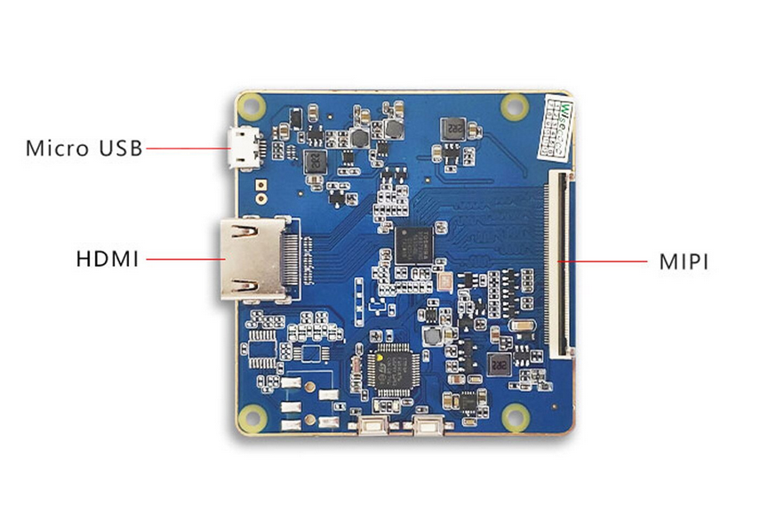
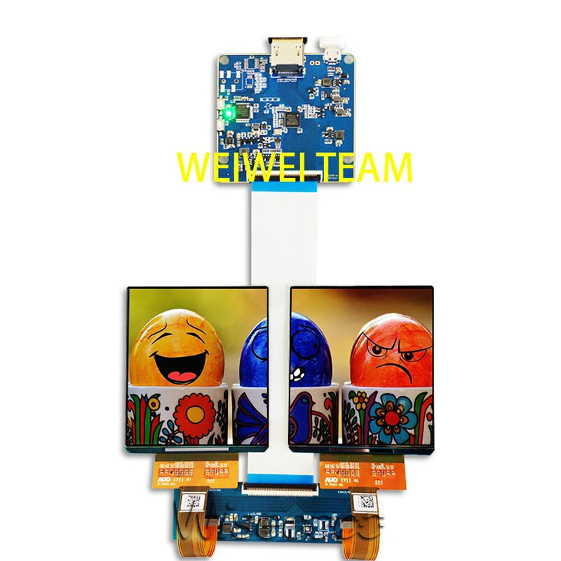
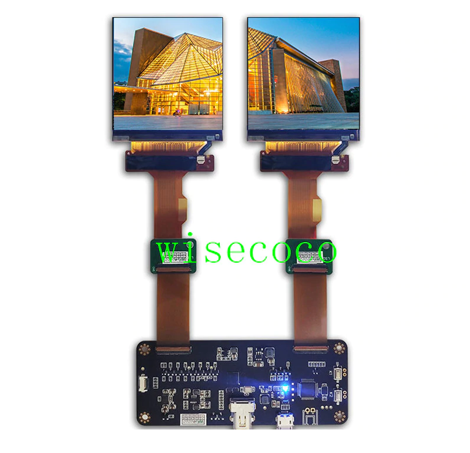
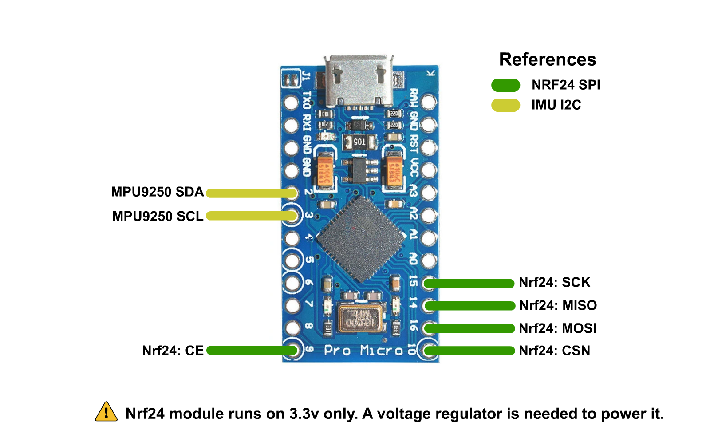

# Headset
The headset will not only be in charge of showing you the image and relaying back rotation data from it's internal IMU, but it will also be in charge of receiving the RF Controller data and sending it back to the computer. Another thing that can be integrated into the headset is an USB Sound Card, that way it'll also have an integrated Microphone and a headphone jack for you to plug your headphones in. Though it's not mandatory.

As of right now, the communication between Headset and PC is done using the arduino's serial port but this is subject to change in the future in favour of USB HID.

I plan on eventually making a custom pcb for the headset that includes a 2 port USB hub, an audio interface for headphones and microphone integration, an STM32 as the main microcontroller and maybe a couple other goodies like an attempt at backlight strobing to reduce screen blur.

# Hardware Needed

## Shell
For the shell you can use any "Phone VR" enclosure, they come in very different qualities but all of them should do the trick (even the carboard ones). Keep in mind the enclosure will dictate your max fov and that you can always modify the shell to allow for a wider fov.

You could also 3d print the shell, like the guys over at [Relativty](https://github.com/relativty/Relativty#building-the-mechanical-parts) did. Keep in mind you'll also need to source your own lenses with the correct focal length and head strap.

⚠️ The screen mount depends on what screen you use and you'll have to design your own sice not all mounts fit all headsets/screen combinations.

## Electronics

Electronics needed as of *right now* is anything that can talk over serial, though this is subject to change once USB HID communication is implemented. So while you technically *could* use an Arduino Nano, I'm going to recommend against it, since once the move to USB HID is done you won't be able to update your driver.

I suggest sticking to stuff that supports the [Arduino HID library](https://www.arduino.cc/en/Reference/HID). An ideal candidate is the Arduino Pro Micro since it's based on the Atmega32u4 and it's fairly small.

Also needed are:
* An MPU9250 to gather rotation data (though you could use any IMU that's fast enough and can output rotation data to quaternions if you modify the code a bit to allow for that).

* An NRF24L01 to receive the controller data from both controllers*

* A 5v to 3.3v voltage regulator to power the NRF24 module*

* A High brightness LED that's a different colour from the ones used on the controllers (I suggest green) and a resistor for that LED for blob tracking (also needed is a white ping pong ball to put the LED into)**

    *: Only needed if you're also building the controllers.
    **: Only needed for 6dof tracking.

## Display(s)

There's a couple different displays you can use for this headset, anything from 4.5 to 6 inches should work just fine.
*As of right now*, using a phone with ALVR or RiftCat or whatever isn't supported though.

You can find these screens on Aliexpress, but make sure what you're getting is what you think you're getting. Ask the seller if the screen **AND** the driver board support the resolution and refresh rate they advertise.

Most of these screens come with a Blue driver board based around the [Toshiba TC358870XBG](https://toshiba.semicon-storage.com/ap-en/semiconductor/product/interface-bridge-ics-for-mobile-peripheral-devices/hdmir-interface-bridge-ics/detail.TC358870XBG.html), be skeptical of these boards since they support a huge multitude of displays at different refresh rates and resolutions, some sellers even claim they can drive two displays at 90hz.

There's a couple different versions of these blue driver boards, the most common one based around the TOSHIBA chip, the other one based on a clone of said chip.

Some screen options are:

### LS055R1SX04 or LS055R1SX03
These screens are 1440x2560(vertical), they officially support up to 60Hz but depending on the driver board they can be pushed to around 70 without artifacts (this depends on the driver board).

⚠️ Make sure you're getting the correct refresh rate since a lot of sellers sell these boards with a driver board that's programmed to run at only 50hz

These are reasonably cheap since they're commonly used in resin 3d printers and can be found for around 50USD.

You can find these boards by searching with the terms "5.5 LCD MIPI"

### Dual AMOLED H380BDN01.1
These screens are 1080x1200 per eye (2560x1200) and they claim to run at 90Hz.
They use the Blue driver board and the screens are 3.81 inches each and use AMOLED displays.

⚠️ Make sure you're getting the correct refresh rate before buying
⚠️ Make sure the driver splits the image into the two displays and doesn't just display the same image across both displays before buying.

These are a lot more expensive than the last one and can be found for around 170USD for the pair of screens + driver board
You can find these boards by searching with the terms "90Hz VR LCD"

### Dual LS029B3SX02
These screens are 1440x1440 per eye (2880x1440) and run at 120hz.
The use a different driver board that uses DisplayPort as a video input and the displays are 2.9 inch IPS LCD.

⚠️ Make sure you're getting the correct refresh rate before buying

These go for around 180USD for the pair of screens and driver board, making them a better purchase than the dual AMOLED if you're looking for high refresh rate.

You can find these boards by searching with the terms "120Hz VR LCD"

# Circuit schematic
Circuit pins for the Arduino pro micro are as follows:

## ⚠️ IMPORTANT: YOU NEED A 5V TO 3.3V REGULATOR TO POWER THE NRF24 MODULE, ***THE PRO MICRO DOES NOT SUPPLY 3.3V ON ANY OF ITS PINS*** 
# Uploading the firmware

To upload the firmware you will need to have the [RF24 Arduino Library](https://github.com/nRF24/RF24) installed in your [Arduino IDE](https://www.arduino.cc/en/software). 

You can download the required library using the Libraries manager from within the Arduino IDE. The rest of the used libaries are already included in the firmware folder.

The steps to upload the firmware are as follows:

* Open Headset.ino inside the Software/Firmware/Headset folder
* Select "Arduino Leonardo" as the board if you're using an Arduino Pro Micro
* Select the correct COM port for the board
* Press the Upload button, if all goes well, you can move to setting the correct COMPort.

# Setting correct COMPort

Chances are, the set COM port on your arduino is not in the 1-9 range (COM13 for example), to configure the driver properly, the Arduino COM port should be between 1-9 the easiest way to change the port is as follows:

Open up device manager and go down to "Ports(COM/LPT)", you should see your Arduino in there, Right click on it and click on properties.

Then click on "Port Settings" and then on "Advanced"

On the bottom of the window there should be something that says "COM Port Number:", click on it and choose a port between 1 and 9. It doesn't matter if it says "in use", Windows will realocate it later.

And then click "OK" and "OK".
Unplug your Arduino and plug it back in. Now if you check on Device manager, your Arduino should be on the port you selected.