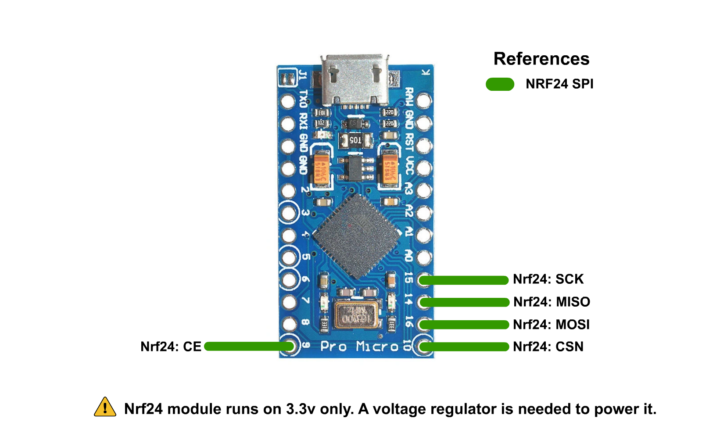

#RF Receiver
This is only needed if you already have an HMD and want to build only the controller part of the setup.

This RF receiver is in charge of receiving rotation and button data from the controllers, replacing the need for the HadesVR headset.

# Hardware Needed
I suggest sticking to stuff that supports the [Arduino HID library](https://www.arduino.cc/en/Reference/HID). An ideal candidate is the Arduino Pro Micro since it's based on the Atmega32u4 and it's fairly small.

Also needed are:
* An NRF24L01 to receive the controller data from both controllers
* A 5v to 3.3v voltage regulator to power the NRF24 module

# Circuit schematic
Circuit pins for the Arduino pro micro are as follows:

## ⚠️ IMPORTANT: YOU NEED A 5V TO 3.3V REGULATOR TO POWER THE NRF24 MODULE, ***THE PRO MICRO DOES NOT SUPPLY 3.3V ON ANY OF ITS PINS*** 

# Uploading the firmware

To upload the firmware you will need to have the [RF24 Arduino Library](https://github.com/nRF24/RF24) installed in your [Arduino IDE](https://www.arduino.cc/en/software). 

You can download the required library using the Libraries manager from within the Arduino IDE. The rest of the used libaries are already included in the firmware folder.

The steps to upload the firmware are as follows:

* Open Receiver.ino inside the Software/Firmware/Receiver folder
* Select "Arduino Leonardo" as the board if you're using an Arduino Pro Micro
* Select the correct COM port for the board
* Press the Upload button, if all goes well, you can move to setting the correct COMPort.

# Setting correct COMPort

Chances are, the set COM port on your arduino is not in the 1-9 range (COM13 for example), to configure the driver properly, the Arduino COM port should be between 1-9 the easiest way to change the port is as follows:

Open up device manager and go down to "Ports(COM/LPT)", you should see your Arduino in there, Right click on it and click on properties.

Then click on "Port Settings" and then on "Advanced"

On the bottom of the window there should be something that says "COM Port Number:", click on it and choose a port between 1 and 9. It doesn't matter if it says "in use", Windows will realocate it later.

And then click "OK" and "OK".
Unplug your Arduino and plug it back in. Now if you check on Device manager, your Arduino should be on the port you selected.