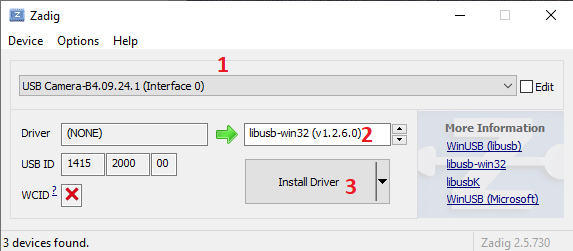

# Tracking
The tracking of both controllers and the HMD is based on the same principle Playstation Move controllers are tracked. That is, by using different coloured blobs, and a camera (or multiple cameras) to know where in space each blob is located.

This type of tracking has the advantage of being reasonably cheap, since the blobs can be made out of ping pong balls and common LED's, and the cameras are standard Playstation Eye cameras.

## Why Playstation Eye cameras and not regular webcams?
- Playstation cameras can do up to 60fps at 640x480 which allows for smoother tracking.
- They are low cost and readily available.
- They have known lens distortion values. 
- All Playstation Eye cameras are created equal, which means a camera bought in the America and a camera bought in Europe will run exactly the same.

# What you'll need
- [Zadig](https://zadig.akeo.ie/)
- [PSMoveService](https://github.com/psmoveservice/PSMoveService/releases)
- [PSMS Calibration mat](https://github.com/psmoveservice/PSMoveService/blob/master/misc/calibration/CalibrationMat.pdf), Ideally printed on letter paper, though A4 works fine too.
- *At least* 2 Playstation Eye cameras (**NOT** EYE TOY).
- USB extensions: you can extend up to 1.8m (6ft) (for a total of 3.6m (12ft)) with passive cables.
⚠️️ if you need more you **will** have to use active cables.

## Why a *minimum* of 2 cameras and the amount I recommend.
A single camera results in jittery tracking since you can't do triangulation on a single camera and no redundancy, meaning that the second your tracking blob gets occluded (be it by your body or by something else) you'll lose all tracking.

Two cameras allow for triangulation and, *to some extent* redundancy. This is the bare minimum I'd recommend for vr.
Though the second one of your blobs gets occluded your tracking will turn into a jittery mess. *This is why I recommend three cameras.*

Three cameras not only allows for smoother, more accurate tracking, but it also allows for redundancy and since you only need two cameras for triangulation you can block the tracking blob for one camera entirely and still have decent tracking.

More cameras would allow for more redundancy, you can hook up as many as you want, but keep in mind USB bandwith limitations and processing power overhead. 

# Installing the camera drivers

Download and install [Zadig](https://zadig.akeo.ie/), we'll be using Zadig to install our libusb camera driver
Plug in all your cameras and open up Device Manager, you'll probably see something similar to this:

To install the drivers open up Zadig, select one of the USB cameras, select libusb-win32 as your driver and click install driver.
⚠️ You should only install the driver on the "Interface 0" cameras

Once it is done installing, select the next camera and repeat the process untill you've installed the drivers for all cameras. If you've done everything correctly, your device manager should look something like this:

# Installing and configuring PSMS

Download and install [PSMoveService-Setup64.exe](https://github.com/psmoveservice/PSMoveService/releases/download/v0.9-alpha9.0.1/PSMoveService-Setup64.exe). Navigate to "C:\Program Files\PSMoveService\bin" and yo should see something like this:

Open PSMoveServiceAdmin.exe and let it run for a couple of seconds for it to create all the config files, after it's done, close it and press  "windows key + R", type in "%appdata%\PSMoveService" (without quotation marks) and press Enter.

You should now see something like this:

* Open "ControllerManagerConfig.json" with notepad and change "virutal_controller_count" to 2, then save and exit
This allows you to calibrate and use PSMoveService without PSMove controllers by creating virtual controllers.

* Open "HMDManagerConfig.json" too and change "virtual_hmd_count" to 1, then save and exit.

After changing those files, run PSMoveServiceAdmin.exe once again for a couple of seconds and then exit.
This should have created a couple new files on your config folder, we're interested in these three in particular:

* Open each one and change "bulb_radius" to "2.0" in all of them
This is necessary because PSMove Controllers use a 4.5cm diameter tracking blob, while we use Ping Pong balls, which are 4cm in diameter.

# Room setup

# Controller calibration